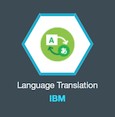

# Watson Hands On Labs - 📷 Image Analysis

The labs cover several [Watson Services][wdc_services] that are available on [IBM Bluemix][bluemix] to build a simple image analysis application. Throughout the workshop, we will navigate through Bluemix, Bluemix Devops Services, Github, and the source code of our application in order to demonstrate how apps can be created quickly and easily using the [IBM Bluemix][bluemix] platform, and the value of [Watson Services][wdc_services] and Cognitive capabilities through APIs.

So let’s get started. The first thing to do is to build out the shell of our application in Bluemix.

## Creating a [IBM Bluemix][bluemix] Account

  1. Go to [https://bluemix.net/](https://bluemix.net/)
  2. Create a Bluemix account if required.
  3. Log in with your IBM ID (the ID used to create your Bluemix account)

**Note:** The confirmation email from Bluemix mail may take up to 1 hour.

## Running  the application locally
  The application uses [Node.js](http://nodejs.org/) and [npm](https://www.npmjs.com/) so you will have to download and install them as part of the steps below.

1. Install [Node.js](http://nodejs.org/)
2. Install the Bluemix CLI and the CF CLI -> Links
3. Run the following commands to connect to your Bluemix account:
  - `bluemix api https://api.ng.bluemix.net/`
  - `bluemix login`
4. List all the Bluemix services
  - `cf marketplace`
5. From that list, create a Visual Recognition and a Text-to-Speech service:
  - `cf cs watson_vision_combined free visual_recognition_name`
  - `cf cs text_to_speech standard text_to_speech_name`
6. Go to your Bluemix Dashboard, click on the two services and write down the credentials (available on the left-hand side: Service Credentials)
7. edit config.js to add the credentials previously retrieved
8. Go to the project folder in a terminal and run:
    `npm install`
5. Start the application
6.  `node app.js`
7. Go to `http://localhost:3000`

## Add additional functionality to the application: Ability to read signs

TODO 

## Add additional services to the application

  1. So far, we have deployed our pre built starter application to Bluemix. We are going to show how easy it is to add additional Watson services to our applications using Bluemix.

  On the Bluemix Dashboard, scroll down to find your Image Analysis application within the "Applications" section. From here, click on the application to open the application homepage.

  

  2. Within the application homepage, we are able to see what services we have already included. You will notice that we already have Text to Speech and Visual Recognition built into the application. We are now going to add a third service into the application.
To do this, click the "Add a Service or API" button on the homepage

  

  3. From the list of Watson services, select the Language Translation service and add it to your application. For the purposes of this lab, all of the default settings of the service will work, so when presented with the Language Translation details page, select the green "Create" button to proceed.

  

  **Note:** you may be prompted to restage your application at this point. This is required in order to rebuild the application with the new Language Translation service that we have added. Select "Restage" to proceed.

We are going to demonstrate how easy it is to use the Watson services on Bluemix to add functionality to existing applications. Our current application can identify images and read out that identification using audio. However let’s say that we wanted to be able to identify these images for a wider user base, which requires translation into other languages.

Luckily, we’ve already started the process to do this. To fully implement the ability to translate these descriptions in our application, we are going to edit our application code to add the Language Translation service that we added earlier.

## Modify the existing application

  1. Let’s edit our source code. Back on the application home page in Bluemix, you will see a link to the IBM Bluemix Devops Jazz Hub repository, and a button to **Edit Code**.
  Click on **Edit Code.**

  2. Clicking on Edit Code will take you to the Jazz Hub repository, which will allow us to edit and push new versions of our code to the application.

  Within the Github repository, navigate to routes folder and select **File -> New -> File** and name the new file `lt.js`

  3. Open up `lt.js` and copy the code below:  

  ```js
  'use strict';

  var watson = require('watson-developer-cloud');

  var languageTranslation = watson.language_translation({
    version: 'v2',
    username: '<<service_username>>',
    password: '<<service_password>>'
  });

  module.exports.translate = function(req, res, next) {
    var params = {
      text: req.body.text,
      model_id: 'en-es',
    };
    languageTranslation.translate(params, function(error, result) {
      if (error)
        return next(error);
      else
        return res.json(result);
    });
  };
  ```
  Note: Make sure to replace service_username & service_password with the username & password of the Language Translation service added.
  The code above will connect the app to the [Language Translation][lt_service] service.

  4. Click on File -> Save or press Crt+S.

  5. Open up your `app.js` and uncomment the line 31. That will add the support for translation with the newly created `routes/lt.js`.


  6. Click on File -> Save or press Crt+S.

## Deploy

  1. The last step in order to complete our application is to deploy our changes to Bluemix. To do this, we need to push our new code to the application. In the code editor screen, switch to the Git view, the 2nd icon in the left navigation bar.

  

  2. Locate your change to app.js file. Check it (select it), add a commit message, and click **Commit**.

  

  3. Click **Sync** to send your changes from this workspace to the main repository and trigger a deploy of your app.

  

  4. Finally, Click on **Build and Deploy** to see the deploy process.

  

**Note:** While this may show as overly complicated, we show it here to illustrate you can have exactly the same source management practices you could have your local environment connected to a Git repository, in the Bluemix DevOps environment.

## Test

To test out our application, navigate back to your application homepage on Bluemix. Select the URL next to "Route" in the same way that we launched our previously unfinished application before.
The new application will perform the same functions are our previous version, but this time you will see translation for the images as well.

# Congratulations
You have completed the Image Analysis Lab! :bowtie:

[bluemix]: https://console.ng.bluemix.net/
[wdc_services]: http://www.ibm.com/smarterplanet/us/en/ibmwatson/developercloud/services-catalog.html
[lt_service]: http://www.ibm.com/smarterplanet/us/en/ibmwatson/developercloud/language-translation.html
